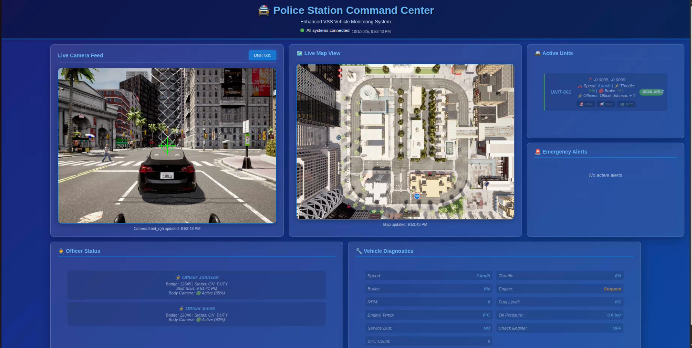
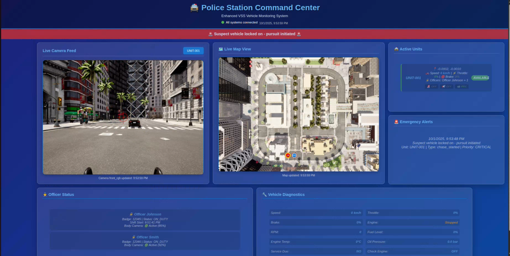

# A kiki — Autonomous Police Patrol & Tracking System

This code is Team A KIKI’s demo for the Eclipse SDV Hackathon 2025.

### Demo video - day


### Demo video - night 


### Dashboard - Before perception


### Dashboard - After perception



## Project Overview

This project implements an **autonomous police patrol and pursuit system** in the CARLA simulator.
Police vehicles patrolling on the CARLA map designate a fleeing vehicle that has committed a crime as the target. Using sensors such as **LiDAR, camera, GPS, and IMU**, they calculate the vehicle’s precise global coordinates and share them with other police vehicles.
With these global coordinates, the police vehicles **pursue, encircle, and capture** the criminal vehicle.

## System Architecture


## Features

- **Track Lock-On :** Detect and cluster target candidates from the LiDAR point cloud, then unify the target using temporal consistency.
- **Refinement of coordinate transformation:** Combine the vehicle IMU (Yaw) with the map coordinate system to perform ENU → World (NED) transformation.
- **Path Generation & Smoothing:** Shortest path + spline-based smoothing (custom “origin-style” smoother)

### controller:

- Pure Pursuit (steering)
- Headway PI (longitudinal) — smooth tracking with low vibration and low overshoot
- Data Bridge: easy integration with web/dashboard/other nodes via Zenoh key–value topics
- Publish VSS (e.g., Vehicle.Speed) to Databroker


## Setup

```bash
# package dependency
python3 -m venv .venv && source .venv/bin/activate
pip install -r requirements.txt   

```

## How to Run

```bash

./run_enhanced_police_system.py 

./run_police_all.py

python3 police_control.py
```

## 👥 Contributors
<p align="left">
  <a href="https://github.com/Eclipse-SDV-Hackathon-Chapter-Three/A-kiki/graphs/contributors" title="Ju-Daeng-E">
    
  </a>
  <a href="https://github.com/Eclipse-SDV-Hackathon-Chapter-Three/A-kiki/graphs/contributors" title="cmh0728">
    
  </a>
  <a href="https://github.com/Eclipse-SDV-Hackathon-Chapter-Three/A-kiki/graphs/contributors" title="jjangddung">
    
  </a>
  <a href="https://github.com/Eclipse-SDV-Hackathon-Chapter-Three/A-kiki/graphs/contributors" title="leo9044">
    
  </a>
  <a href="https://github.com/Eclipse-SDV-Hackathon-Chapter-Three/A-kiki/graphs/contributors" title="jojeongmin304">
    
  </a>
</p>
