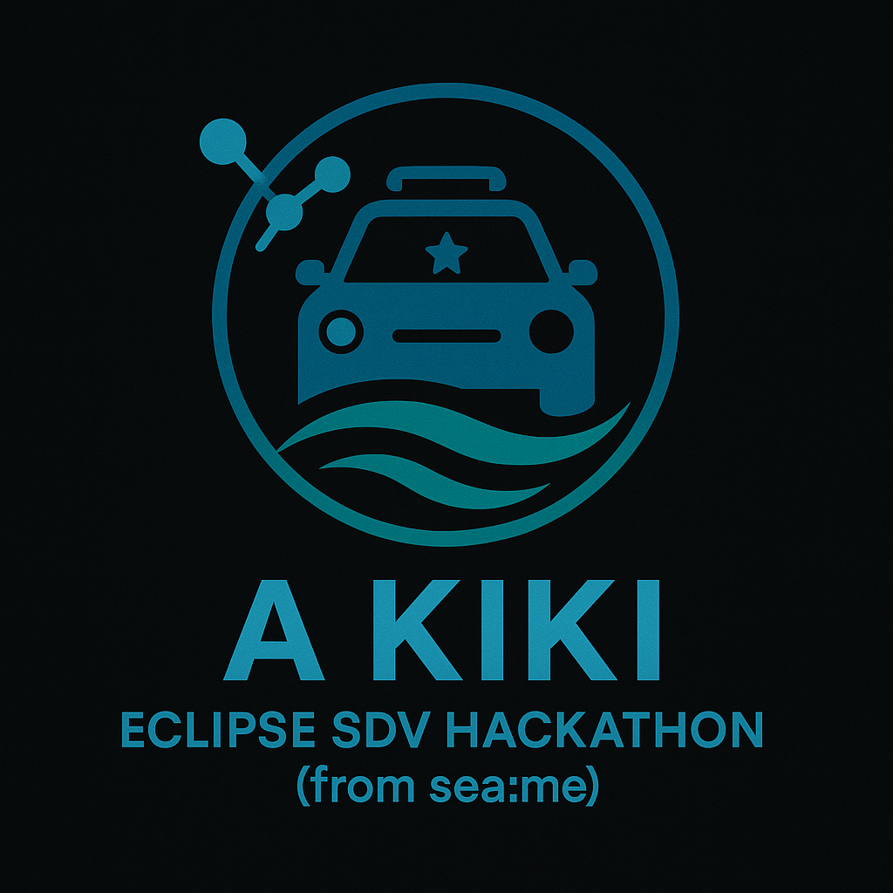
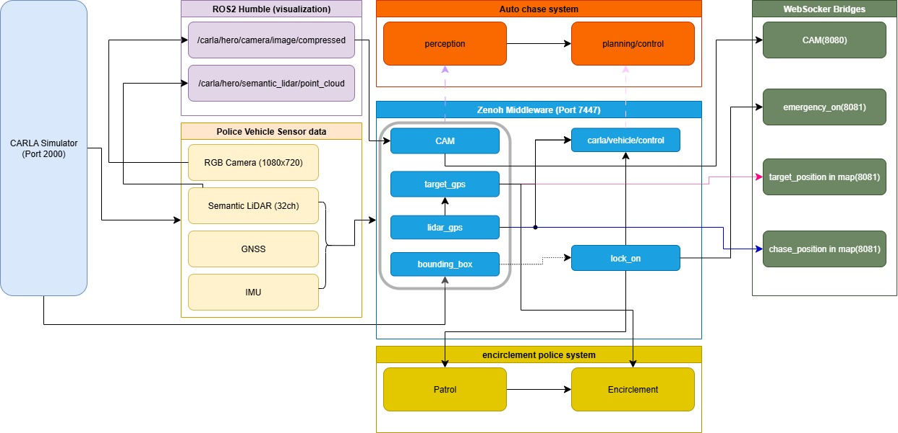

# 1. Your Team at a Glance

## Team Name / Tagline  
### *A kiki*
We are from South Korea to win this HACKATHON !!!✊✊✊

## Team Members  
| Name | GitHub Handle | Role(s) |
|-------|---------------|---------|
| Juhun Kang | [Ju-Daeng-E](https://github.com/Ju-Daeng-E) | Team Leader/Developer |
| DongMin Jang | [jjangddung](https://github.com/jjangddung) | Developer |
| JaeHong Lim | [Jae Hong Lim](https://github.com/leo9044) | Developer |
| MinHyeok Choi | [kevin choi](https://github.com/cmh0728) | Developer |
| JeongMin Jo | [JeongMin](https://github.com/jojeongmin304) | Developer | 

## Challenge  
<!-- *Which challenge have you decided to compete for?* -->

**SDV Lab Challenge**

## Core Idea  
<!-- *What is your rough solution idea?* -->

### The Problem
Current vehicle pursuit scenarios are dangerous and inefficient:
- **Driver overload**: Officers must drive at high speeds while tracking suspects, using radio, and reporting
- **Poor coordination**: Other units only hear audio descriptions, can't visualize suspect location
- **No video sharing**: Command center can't see real-time pursuit footage
- **Manual tracking**: Officers struggle to keep visual contact during pursuit

### Our Solution: Autonomous Lock-on & Coordinated Pursuit System

**1. Automatic Lock-on**
- Semantic LiDAR detects collision/crime events
- Automatically identifies and locks onto suspect vehicle
- ObjIdx-based tracking maintains lock across frames
- No manual targeting needed

**2. Autonomous Pursuit**
- Chase vehicle automatically follows locked target
- Officer focuses on assessment and decision-making, not driving
- Safer pursuit with AI-controlled vehicle dynamics

**3. Real-time Video Streaming**
- Live pursuit camera feed via Zenoh → WebSocket
- Command center monitors situation on web dashboard
- Better tactical decisions with visual context

**4. VSS-based Coordinate Broadcast**
- Suspect GPS coordinates in standardized VSS format
- Real-time broadcast via Zenoh to all nearby units
- 50ms update rate for accurate positioning

**5. Coordinated Encirclement**
- Encirclement units receive target coordinates automatically
- A* pathfinding calculates optimal interception routes
- Autonomous deployment for strategic positioning
- Multi-vehicle coordination without radio chatter

### Technology Stack
- **CARLA 0.9.15**: Safe simulation environment
- **ROS2 Humble**: Sensor processing and vehicle control
- **Zenoh**: Ultra-low-latency messaging (<50ms)
- **VSS**: Standardized vehicle data format
- **WebSocket**: Real-time dashboard streaming

### Key Innovation
Combining **LiDAR-based lock-on**, **autonomous pursuit**, and **VSS-standardized coordinate sharing** enables multiple police vehicles to 
coordinate seamlessly without manual communication overhead.

---

# 2. How Do You Work

## Development Process  
<!-- *Brief overview of your development process.* -->

Our team is divided into three specialized groups:

**Chase Police Team** - Implementing police vehicles that lock-on to criminal vehicles and pursue them relentlessly until encirclement is achieved
- DongMin Jang, MinHyeok Choi
  
**Encirclement Police Team** - Implementing police vehicles that receive lock-on signals and dispatch to the criminal vehicle's location via optimal routes
- JaeHong Lim, JeongMin Jo
  
**Infrastructure & Integration Team** - Implementing workload orchestration using Ankaios, backbone network configuration, web interface development, and overall coordination
- Juhun Kang

### Planning & Tracking  
<!-- *How do you plan and track progress?* -->

**Each team develops and tests their code locally using CARLA 0.9.15. Once implementation and debugging are complete, we integrate all nodes together for system-wide testing.**

### Quality Assurance  
<!-- *How do you ensure quality (e.g., testing, documentation, code reviews)?* -->

1. Testing

- Unit testing per team
- Integration testing
- Latency measurement for each component

2. Documentation

- README documentation
- User guide

3. Code Reviews

- Cross-team code reviews during integration
- Continuous feedback and iteration

## Communication  
<!-- *How does your team communicate?* -->

**We communicate face-to-face in our workspace, enabling rapid problem-solving and real-time collaboration. Additionally, we use messaging platforms for asynchronous updates and documentation sharing.**

## Decision Making  
<!-- *How are decisions made in your team?* -->

Approach 1: Team leader proposes ideas → Team members provide feedback → Implementation and testing

Approach 2: Team members propose ideas → Team leader and other members review → Implementation and testing

We maintain a collaborative decision-making process where all voices are heard, and decisions are validated through actual implementation and testing results.
